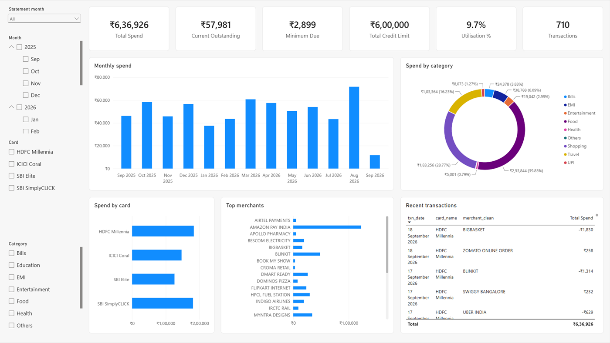
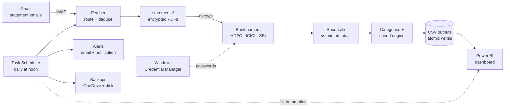
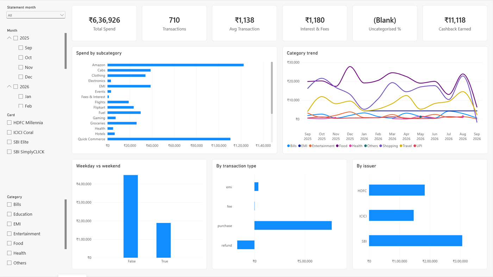
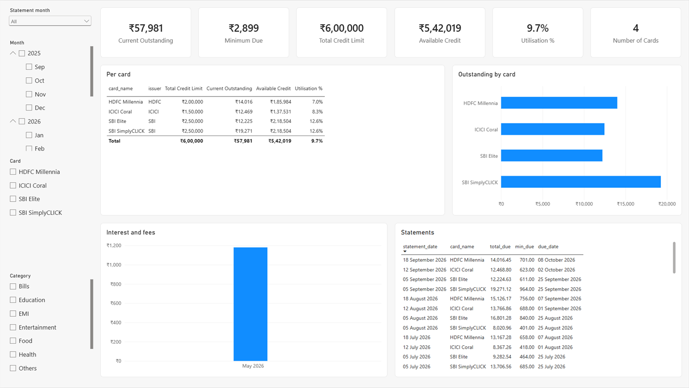
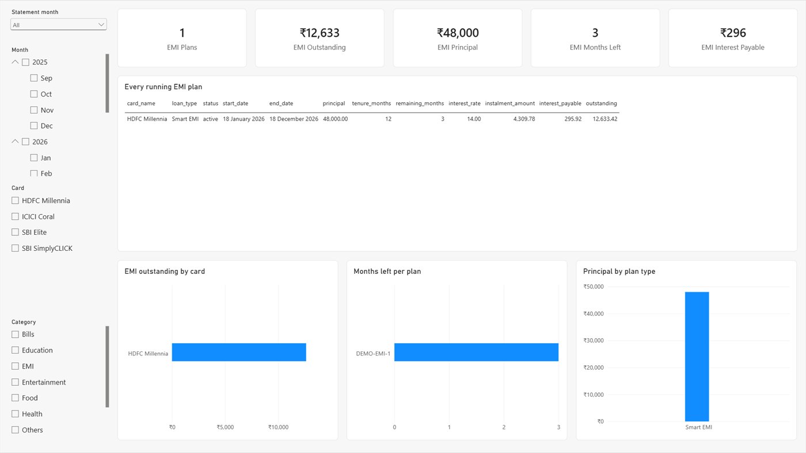
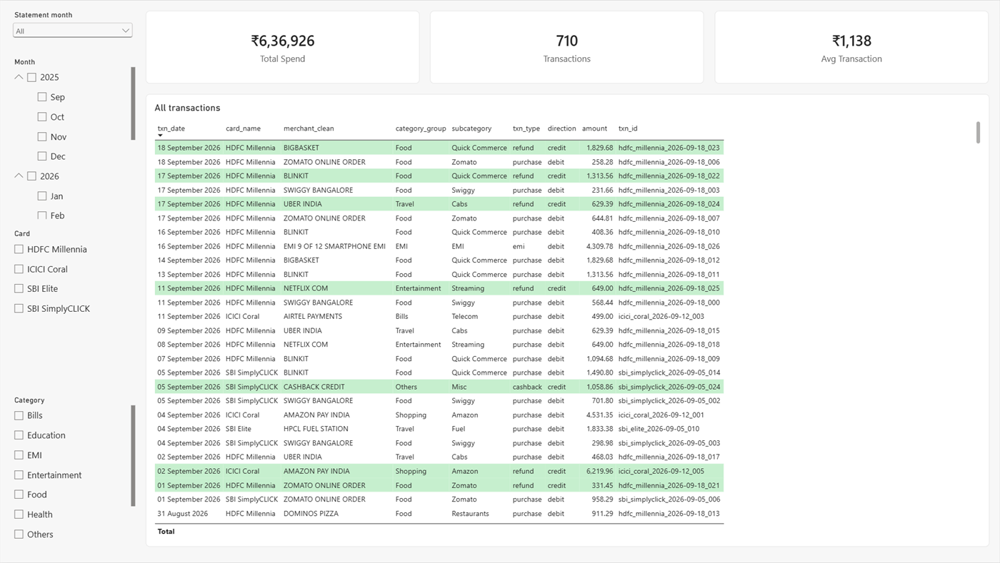

<div align="center">

# Credit Card Spend Intelligence

**Password-protected bank PDFs in. A self-updating Power BI dashboard out.**

This project fetches credit card statements from Gmail, then decrypts and parses them.
It reconciles every statement against the bank's own printed totals and keeps a Power BI
dashboard current. Each day it sends one alert email, and no step is manual.

[](https://github.com/tanumay-deb/credit-card-spend-intelligence/actions/workflows/ci.yml)


</div>



<sub>Every screenshot shows the made-up data from `cards demo`, not real statements.</sub>

---

## The problem

I have seven credit cards across three banks: HDFC, ICICI and SBI. Every statement
arrives as an **encrypted PDF**, and each bank lays its statement out differently.
Power BI cannot open password-protected PDFs, and no app shows every card in one place.
So spending, dues, EMIs and credit utilisation were spread across dozens of PDFs in an
inbox.

## What it does

| | |
|---|---|
| **Collects** | Pulls statement emails from Gmail over IMAP every day. Routes each PDF to its card, and skips any PDF it already has. |
| **Reads** | Decrypts each PDF and parses the HDFC, ICICI and SBI layouts with one parser per bank. The parsers handle wrapped headers, "IMMEDIATE" due dates, rows that continue onto the next line, and EMI tables. |
| **Verifies** | Reconciles every statement. The debits parsed from a statement must add up to the bank's printed purchases plus charges, to the paisa. |
| **Understands spend** | Counts what was billed. A refund comes off the purchase it cancels, an EMI conversion nets to zero, and a bounced autopay isn't counted. |
| **Categorises** | Checks a merchant map first, then keyword rules in priority order, then a UPI fallback. **98.6% of spend is categorised.** |
| **Visualises** | A 5-page Power BI dashboard with 21 DAX measures, shown in the Indian number format (lakhs, not millions). |
| **Alerts** | Sends a daily email and a Windows notification. Each new statement comes with its dues and top spending categories, and each problem with a line on how to fix it. Every item is told exactly once. |
| **Refreshes** | If the dashboard is open, it refreshes itself after new data arrives. A desktop shortcut opens the dashboard and refreshes it. |
| **Secures** | Keeps passwords in Windows Credential Manager. A pre-commit guard stops statements, outputs and card numbers from ever reaching git. |
| **Backs up** | Copies new or changed files to OneDrive and to a second disk, and never deletes from a backup. |

## How it works



**One daily check:**
1. fetch → import (only when something is new) → refresh Power BI → back up;
2. work out what's worth telling you → email and notify → remember what was told.

Every step can be replaced in tests, so the whole sequence is tested without Gmail,
Power BI or the notification centre.

## The dashboard

| Page | What it answers |
|---|---|
| **Overview** | How much did I spend this month, on what, and at which merchants? |
| **Spending Analysis** | Where is the money going by category? It also shows cashback earned, and fees and interest paid. |
| **Cards & Bills** | What is owed on each card right now? It shows the minimum due, the available credit (the two SBI cards share one limit, and so do the three ICICI cards), and utilisation. |
| **EMI** | Which loans are running, with months left and principal versus interest still to pay. |
| **Transactions** | Every transaction, filtered by year and month, with refunds and credits highlighted. |

Four filters sit down the left of every page: statement month, calendar month, card and
category. A choice made on one page carries to the others. **Statement month** groups
purchases by the bill they landed on, not the day they were made, because a statement
runs across two calendar months.

| Spending Analysis | Cards & Bills |
|---|---|
|  |  |
| **EMI** | **Transactions** |
|  |  |

The report is saved as a **`.pbip` project**, meaning TMDL and PBIR text files. The model
and visuals live in git as reviewable text, and the data never does.

## A day in the life

The noon check emails a summary like this (illustrative numbers):

```text
Subject: Credit cards: 1 new statement, 1 needs attention

New statements
- SBI Elite: September statement imported (15 Aug to 14 Sep).
  Total due ₹18,420, minimum ₹920, due 4 Oct 2026 (in 8 days).
  Spent ₹17,960 in 42 transactions: Quick Commerce ₹4,210 (23%), EMI ₹3,500 (19%),
  Restaurants ₹2,980 (17%).

Power BI was open and has been refreshed.

Needs attention
- HDFC Millennia: no October statement yet (expected around 18 Oct).
  Look for it in Gmail. If this card is billed only in months you use it, set
  monthly=no for it in config/cards.csv.
```

## Engineering highlights

- **Reconciliation as the test oracle.**
  - PDF text extraction fails silently: a dropped line simply disappears.
  - So every statement is checked against the bank's own totals, and a mismatch makes
    the run exit with an error.
  - That check caught a header wrapped over two lines, EMI columns read in the wrong
    order, and noise introduced when the test fixtures were redacted.
- **Spend that matches the bill.**
  - A refund is matched to the purchase it cancels: same card, exact amount, within 90
    days, nearest first, and each purchase used only once.
  - An EMI conversion's credit lands inside EMI and nets to zero.
  - A bounced autopay is paired with the payment it reverses and left out of spend.
- **EMI maths.**
  - A missing instalment is worked out with the annuity formula.
  - A missing rate is solved by bisection.
  - ICICI prints its outstanding with the future interest included. It's split into
    principal and interest by present value, so it lines up with how HDFC reports
    these figures.
- **Refreshing Power BI Desktop the supported way.**
  - Microsoft doesn't support sending processing commands to Desktop's model.
  - So the job presses Desktop's own Refresh button through Windows UI Automation.
  - It then confirms the refresh with a read-only query on the model's
    `RefreshedTime`.
- **Writes that survive Excel.**
  - Outputs are written to temporary files first.
  - They are swapped in only when no target is locked. A CSV open in Excel can never
    leave the dataset half-updated.
- **Alerts told once.**
  - Every alert has a stable key, and a small memory file tracks what has been sent.
  - A problem is told once, and again only if it's fixed and then comes back.
  - The first run doesn't announce the whole history.
  - A rejected login is reported immediately. A network error is reported only if it
    happens on two runs in a row.
- **Secrets hygiene.**
  - Passwords are kept in Windows Credential Manager (DPAPI, per user).
  - A pre-commit hook blocks statements, outputs, any stored password, and 16-digit
    numbers that pass the Luhn check card numbers use. CI rechecks every tracked file.

## Tech stack

| Area | Tools |
|---|---|
| Language | Python 3.11 (`Decimal` money, frozen dataclasses) |
| PDF | pypdf, pdfplumber |
| Data | pandas, openpyxl, CSV |
| BI | Power BI Desktop, DAX, TMDL + PBIR (`.pbip`) |
| Automation | Windows Task Scheduler, PowerShell 5.1, UI Automation, WinRT notifications |
| Email | IMAP (fetch), SMTP (alerts) |
| Security | `keyring` with Windows Credential Manager, a pre-commit guard |
| Quality | pytest (389 tests), ruff, mypy, pinned lockfile, GitHub Actions on Windows |

## By the numbers

- **Scale:** 7 cards, 3 banks, 61 statements and 1,100+ transactions parsed.
- **Reconciliation:** 100% of statements match the bank's printed totals.
- **Categorisation:** 98.6% of spend is categorised, up from 52% when the project started.
- **Size:** 369 automated tests, about 4,800 lines of Python, 21 DAX measures and 5
  report pages.

## Quick start

```bash
git clone https://github.com/tanumay-deb/credit-card-spend-intelligence.git
cd CreditCard
python -m venv .venv
.venv\Scripts\python.exe -m pip install -r requirements.lock
copy config\secrets.env.example config\secrets.env
cards vault set EMAIL_PASSWORD
cards fetch --months 12
cards ingest
cards dashboard
powershell -ExecutionPolicy Bypass -File tools\install.ps1
```

What these steps do:
- `config\secrets.env` holds this PC's settings: your Gmail address and backup folders.
- Passwords go into Windows Credential Manager with `cards vault set`.
- The last command schedules the daily check and puts the dashboard shortcut on the
  desktop.

**No statements? Try the demo.** `cards demo` writes a year of made-up statements for
four made-up cards, and `cards dashboard --demo` opens the dashboard on them.

The [usage guide](docs/usage.md) covers everything: cards, categories, payments,
backups, the daily check, and moving to a new PC.

## Project layout

```text
creditcard/            the Python package
  parsers/             one parser per bank (HDFC, ICICI, SBI)
  commands/            the `cards` subcommands
  pipeline.py          import: parse, reconcile, categorise, write outputs
  spend.py             spend as billed: refunds and EMI conversions settled
  daily.py             the daily check: fetch, import, refresh, back up, alert
  alerts.py, notify.py what to tell you, and the email and notification
  vault.py             passwords in Windows Credential Manager
dashboard.pbip         the Power BI report and model, as text (TMDL + PBIR)
config/                your cards, categories and rules (hand-edited CSV)
tools/                 PowerShell: install, refresh, open; the secret guard
tests/                 389 tests; bank fixtures are redacted statement text
docs/                  usage guide, design specs and plans
```

## Privacy

This repository holds no financial data:
- Statements, outputs and passwords are git-ignored, and a commit hook blocks them.
- The parser tests run on real statement layouts in which
  [`tools/redact_statement.py`](tools/redact_statement.py) has replaced every name,
  number and amount. The totals still reconcile after redaction.

## Design notes

Each feature started from a written design and an implementation plan, kept in the
private working repository along with the real statements it was built against.

---|---|---|
| Ingestion pipeline | [design](docs/superpowers/specs/2026-09-08-credit-card-powerbi-dashboard-design.md) | [plan](docs/superpowers/plans/2026-09-08-ingestion-pipeline.md) |
| Trustworthy spend | [design](docs/superpowers/specs/2026-09-11-trustworthy-spend-design.md) | [plan](docs/superpowers/plans/2026-09-11-trustworthy-spend.md) |
| Daily check and alerts | [design](docs/superpowers/specs/2026-09-25-daily-run-design.md) | [plan](docs/superpowers/plans/2026-09-25-daily-run.md) |
| Security and portability | [design](docs/superpowers/specs/2026-09-25-secure-portable-design.md) | [plan](docs/superpowers/plans/2026-09-25-secure-portable.md) |
| Engineering hygiene | [design](docs/superpowers/specs/2026-09-25-hygiene-design.md) | [plan](docs/superpowers/plans/2026-09-25-hygiene.md) |

---

<div align="center">

Built by **Tanumay Goswami** · [GitHub](https://github.com/tanumay-deb)

</div>
